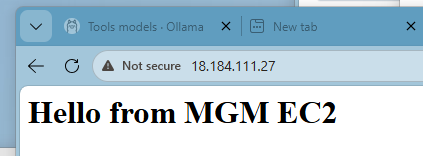

# EC2 Welcome App

## Overview

This project demonstrates a simple AWS EC2 deployment using a `user-data` bootstrap script.

When the instance starts for the first time, it automatically:

* installs Apache HTTP Server (`httpd`)
* enables and starts the service
* creates a custom welcome page

The goal is to show a minimal but production-like example of infrastructure bootstrap automation.

---

## Architecture

AWS EC2 instance
→ executes `user-data` at first boot
→ installs and starts Apache (`httpd`)
→ serves a static HTML welcome page

---

## Repository Structure

```text
ec2-welcome-app/
├── README.md
├── userdata/
│   └── userdata_httpd.bash
├── scripts/
│   └── create_ec2_example.bash
├── config.example.bash
├── config.local.bash (not versioned)
├── .gitignore
```

---

## How It Works

The `user-data` script is passed during EC2 creation.

At first boot, the instance automatically:

1. updates system packages
2. installs Apache
3. starts and enables the web server
4. writes a custom `index.html` page

---

## Configuration

This project separates **code** from **environment-specific configuration**.

### 1. Copy the example config

```bash
cp config.example.bash config.local.bash
```

### 2. Edit with your values

```bash
nano config.local.bash
```

Example:

```bash
AMI_ID="ami-xxxxxxxx"
KEY_NAME="your-keypair"
SECURITY_GROUP_ID="sg-xxxxxxxx"
SUBNET_ID="subnet-xxxxxxxx"
```

### 3. Important

* `config.local.bash` is **not committed**
* it is ignored via `.gitignore`
* never store credentials or sensitive data in the repository

---

## Cloud Requirements

Before running the script, ensure:

* AWS CLI is configured (`aws configure`)
* A valid key pair exists
* The security group allows HTTP access:

```text
Port 80 → 0.0.0.0/0
```

---

## How to Deploy

```bash
./scripts/create_ec2_example.bash
```

Then open the public IP in your browser.

---

## Demo

This application is deployed on AWS EC2 using a fully automated bootstrap process.

Example output:



---

## Cleanup

Terminate the instance to avoid costs:

```bash
aws ec2 terminate-instances \
  --region eu-central-1 \
  --instance-ids <INSTANCE_ID>
```

---

## Cloud Scope

This is a demonstration project focused on:

* EC2 provisioning basics
* Linux service bootstrap
* reproducible setup through scripting

---

## Next Improvements

Possible future extensions:

* parameterized EC2 creation script
* Nginx alternative
* HTTPS setup
* deployment through Terraform or CloudFormation

---

## Author

Maurizio Morgano
